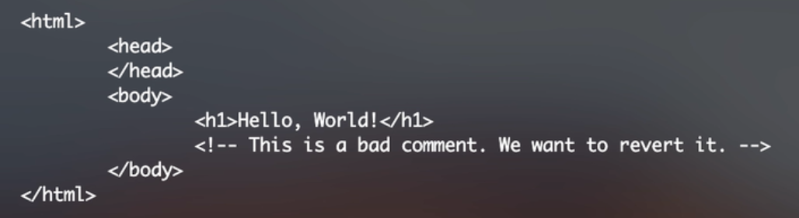
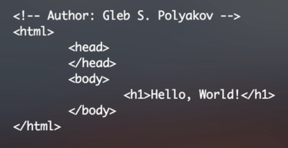
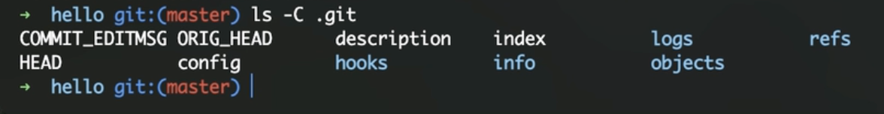
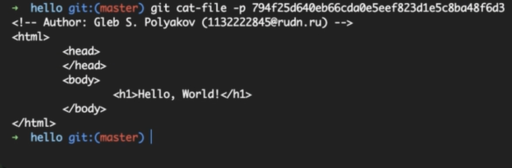
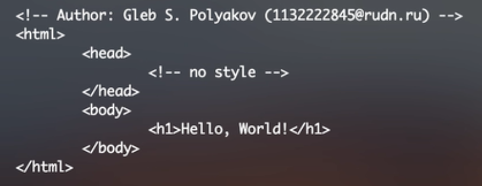

---
## Front matter
lang: ru-RU
title: Лабораторная работа №1
subtitle: Работа с git
author:
  - Поляков Г. С.
institute:
  - Российский университет дружбы народов, Москва, Россия
date: 22 февраля 2025

## i18n babel
babel-lang: russian
babel-otherlangs: english

## Formatting pdf
toc: false
toc-title: Содержание
slide_level: 2
aspectratio: 169
section-titles: true
theme: metropolis
header-includes:
 - \metroset{progressbar=frametitle,sectionpage=progressbar,numbering=fraction}
---

# Информация

## Докладчик

:::::::::::::: {.columns align=center}
::: {.column width="70%"}

  * Поляков Глеб Сергеевич
  * студент
  * Российский университет дружбы народов

:::
::: {.column width="30%"}

:::
::::::::::::::

# Создание проекта
	
## Создайте страницу «Hello, World»

- тест
{#fig:001 width=70%}

## Создание репозитория

- тест
{#fig:002 width=70%}

## Проверка состояния репозитория

{#fig:003 width=70%}

# 1.3 Внесение изменений
	
## 1.3.1 Измените страницу «Hello, World»

{#fig:004 width=70%}

# 1.4 Индексация изменений
	
## 1.4.1 Коммит изменений

{#fig:005 width=70%}

## 1.4.2 Добавьте стандартные теги страницы

{#fig:006 width=70%}

## 1.4.3 История

{#fig:007 width=70%}

## 1.4.4 Получение старых версий

{#fig:008 width=70%}

## 1.4.5 Создание тегов версий

{#fig:009 width=70%}

## 1.4.6 Переключение по имени тега

{#fig:010 width=70%}

# 1.5 Отмена локальных изменений (до индексации)
	
## 1.5.1 Переключитесь на ветку master

{#fig:011 width=70%}

## 1.5.2 Измените hello.html

{#fig:012 width=70%}

## 1.5.3 Проверьте состояние

{#fig:013 width=70%}

## 1.5.4 Отмена изменений в рабочем каталоге

{#fig:014 width=70%}

# 1.6 Отмена проиндексированных изменений (перед коммитом)
	
## 1.6.1 Измените файл и проиндексируйте изменения

{#fig:015 width=70%}

## 1.6.2 Проверьте состояние

{#fig:016 width=70%}

## 1.6.3 Выполните сброс буферной зоны

{#fig:017 width=70%}

## 1.6.4 Переключитесь на версию коммита

{#fig:018 width=70%}

# 1.7 Отмена коммитов
	
## 1.7.1 Отмена коммитов

{#fig:019 width=70%}	
## 1.7.2 Измените файл и сделайте коммит

{#fig:020 width=70%}

## 1.7.3 Сделайте коммит с новыми изменениями, отменяющими предыдущие

{#fig:021 width=70%}

## 1.7.4 Проверьте лог

{#fig:022 width=70%}

# 1.8 Удаление коммитов из ветки
	
## 1.8.1 Команда git reset

{#fig:023 width=70%}

## 1.8.2 Проверьте нашу историю

{#fig:024 width=70%}

## 1.8.3 Для начала отметьте эту ветку

{#fig:025 width=70%}

## 1.8.4 Сброс коммитов к предшествующим коммиту Oops

{#fig:026 width=70%}

## 1.8.5 Ничего никогда не теряется

{#fig:027 width=70%}

## 1.8.6 Опасность сброса

{#fig:028 width=70%}

# 1.9 Удаление тега oops
	
## 1.9.1 Удаление тега oops

{#fig:029 width=70%}

# 1.10 Внесение изменений в коммиты
	
## 1.10.1 Измените страницу, а затем сделайте коммит

{#fig:030 width=70%}

## 1.10.2 Необходим email

{#fig:031 width=70%}

## 1.10.3 Измените предыдущий коммит

{#fig:032 width=70%}

## 1.10.4 Просмотр истории

{#fig:033 width=70%}

# 1.11 Перемещение файлов

## 1.11.1 Переместите файл hello.html в каталог lib

{#fig:034 width=70%}

# 1.12 Второй способ перемещения файлов
	
## 1.12.1 Коммит в новый каталог

{#fig:035 width=70%}

# 1.13 Подробнее о структуре
	
## 1.13.1 Добавление index.html

{#fig:036 width=70%}

# 1.14 Git внутри: Каталог .git
	
## 1.14.1 Каталог .git

{#fig:037 width=70%}

## 1.14.2 База данных объектов

{#fig:038 width=70%}

## 1.14.3 Углубляемся в базу данных объектов

{#fig:039 width=70%}

## 1.14.4 Config File

{#fig:040 width=70%}

## 1.14.5 Ветки и теги

{#fig:041 width=70%}

## 1.14.6 Файл HEAD

{#fig:042 width=70%}

# 1.15 Работа непосредственно с объектами git
	
## 1.15.1 Поиск последнего коммита

{#fig:043 width=70%}

## 1.15.2 Вывод последнего коммита с помощью SHA1 хэша

{#fig:044 width=70%}

## 1.15.3 Поиск дерева

{#fig:045 width=70%}

## 1.15.4 Вывод каталога lib

{#fig:046 width=70%}

## 1.15.5 Вывод файла hello.html

{#fig:047 width=70%}

## 1.15.6 Исследуйте самостоятельно

{#fig:048 width=70%}

# 1.16 Создание ветки
	
## 1.16.1 Создайте ветку

{#fig:049 width=70%}

## 1.16.2 Добавьте файл стилей style.css

{#fig:050 width=70%}

## 1.16.3 Измените основную страницу

{#fig:051 width=70%}

## 1.16.4 Измените index.html

{#fig:052 width=70%}

# 1.17 Навигация по веткам
	
## 1.17.1 Переключение на ветку master

{#fig:053 width=70%}

## 1.17.2 Вернемся к ветке style

{#fig:054 width=70%}

# 1.18 Изменения в ветке master
	
## 1.18.1 Создайте файл README в ветке master

{#fig:055 width=70%}

# 1.19 Сделайте коммит изменений README.md в ветку master.
	
## 1.19.1 Просмотр отличающихся веток

{#fig:056 width=70%}

## 1.19.2 Просмотрите текущие ветки

{#fig:057 width=70%}

# 1.20 Слияние
	
## 1.20.1 Слияние веток

{#fig:058 width=70%}

# 1.21 Создание конфликта
	
## 1.21.1 Вернитесь в master и создайте конфликт

{#fig:059 width=70%}

## 1.21.2 Просмотр веток

{#fig:060 width=70%}

# 1.22 Разрешение конфликтов
	
## 1.22.1 Слияние master с веткой style

{#fig:061 width=70%}

## 1.22.2 Решение конфликта

{#fig:062 width=70%}

## 1.22.3 Сделайте коммит решения конфликта

{#fig:063 width=70%}

## 1.22.4 Перебазирование как альтернатива слиянию

{#fig:064 width=70%}

# 1.23 Сброс ветки style
	
## 1.23.1 Сброс ветки style

{#fig:065 width=70%}

## 1.23.2 Проверьте ветку

{#fig:066 width=70%}

# 1.24 Сброс ветки master
	
## 1.24.1 Сброс ветки master

{#fig:067 width=70%}

# 1.25 Перебазирование
	
## 1.25.1 Слияние VS перебазирование

{#fig:068 width=70%}

# 1.26 Слияние в ветку master
	
## 1.26.1 Слияние style в master

{#fig:069 width=70%}

## 1.26.2 Просмотрите логи

{#fig:070 width=70%}

# 1.27 Клонирование репозиториев
	
# 1.27.1 Перейдите в рабочий каталог

{#fig:071 width=70%}

## 1.27.2 Создайте клон репозитория hello

{#fig:072 width=70%}

# 1.28 Просмотр клонированного репозитория
	
## 1.28.1 Давайте взглянем на клонированный репозиторий

{#fig:073 width=70%}

## 1.28.2 Просмотрите историю репозитория

{#fig:074 width=70%}

## 1.28.3 Удаленные ветки

{#fig:075 width=70%}

# 1.29 Что такое origin?

{#fig:076 width=70%}

# 1.30 Удаленные ветки

{#fig:077 width=70%}

## 1.30.1 Список удаленных веток

{#fig:078 width=70%}

# 1.31 Внесите изменения в оригинальный репозиторий hello

## 1.31.1 Внесите изменения в оригинальный репозиторий hello

{#fig:079 width=70%}

## 1.31.2 Извлечение изменений

{#fig:080 width=70%}

## 1.31.3 Проверьте README.md

{#fig:081 width=70%}

# 1.32 Слияние извлеченных изменений

## 1.32.1 Слейте извлеченные изменения в локальную ветку master

{#fig:082 width=70%}

## 1.32.2 Еще раз проверьте файл README.md

{#fig:083 width=70%}

# 1.33 Добавление ветки наблюдения

## 1.33.1 Добавьте локальную ветку, которая отслеживает удаленную ветку

{#fig:084 width=70%}

## 1.34 Чистые репозитории

{#fig:085 width=70%}

## 1.35 Создайте чистый репозиторий

{#fig:086 width=70%}

## 1.36 Добавление удаленного репозитория

{#fig:087 width=70%}

## 1.37 Отправка изменений

{#fig:088 width=70%}

## 1.38 Извлечение общих изменений

{#fig:089 width=70%}