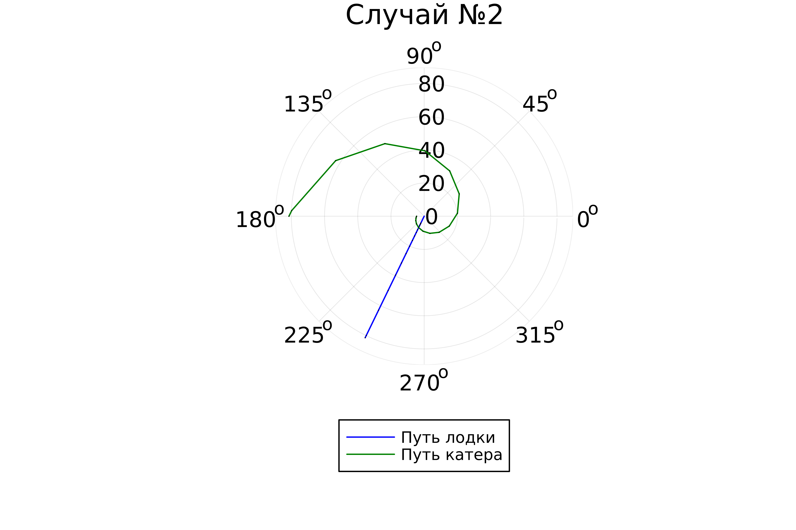

---
## Front matter
title: "Отчет о лабораторной работе №2"
subtitle: "Задача о погоне"
author: "Поляков Глеб Сергеевич"

## Generic otions
lang: ru-RU
toc-title: "Содержание"

## Bibliography
bibliography: bib/cite.bib
csl: pandoc/csl/gost-r-7-0-5-2008-numeric.csl

## Pdf output format
toc: true # Table of contents
toc-depth: 2
lof: true # List of figures
lot: true # List of tables
fontsize: 12pt
linestretch: 1.5
papersize: a4
documentclass: scrreprt
## I18n polyglossia
polyglossia-lang:
  name: russian
  options:
	- spelling=modern
	- babelshorthands=true
polyglossia-otherlangs:
  name: english
## I18n babel
babel-lang: russian
babel-otherlangs: english
## Fonts
mainfont: IBM Plex Serif
romanfont: IBM Plex Serif
sansfont: IBM Plex Sans
monofont: IBM Plex Mono
mathfont: STIX Two Math
mainfontoptions: Ligatures=Common,Ligatures=TeX,Scale=0.94
romanfontoptions: Ligatures=Common,Ligatures=TeX,Scale=0.94
sansfontoptions: Ligatures=Common,Ligatures=TeX,Scale=MatchLowercase,Scale=0.94
monofontoptions: Scale=MatchLowercase,Scale=0.94,FakeStretch=0.9
mathfontoptions:
## Biblatex
biblatex: true
biblio-style: "gost-numeric"
biblatexoptions:
  - parentracker=true
  - backend=biber
  - hyperref=auto
  - language=auto
  - autolang=other*
  - citestyle=gost-numeric
## Pandoc-crossref LaTeX customization
figureTitle: "Рис."
tableTitle: "Таблица"
listingTitle: "Листинг"
lofTitle: "Список иллюстраций"
lotTitle: "Список таблиц"
lolTitle: "Листинги"
## Misc options
indent: true
header-includes:
  - \usepackage{indentfirst}
  - \usepackage{float} # keep figures where there are in the text
  - \floatplacement{figure}{H} # keep figures where there are in the text
---

# Цель работы

Необходимо определить по какой траектории необходимо двигаться катеру,
чтоб нагнать лодку.

# Задание

1. Провести аналогичные рассуждения и вывод дифференциальных уравнений, если скорость катера больше скорости лодки в n раз (значение n задайте самостоятельно)
2. Построить траекторию движения катера и лодки для двух случаев. (Задайте самостоятельно начальные значения)

Определить по графику точку пересечения катера и лодки.

# Теоретическое введение

##Задача о погоне

Приведем один из примеров построения математических моделей для выбора правильной стратегии при решении задач поиска.
Например, рассмотрим задачу преследования браконьеров береговой охраной. На море в тумане катер береговой охраны преследует лодку браконьеров. Через определенный промежуток времени туман рассеивается, и лодка обнаруживается на расстоянии k км от катера. Затем лодка снова скрывается в тумане и уходит прямолинейно в неизвестном направлении. Известно, что скорость
катера в 2 раза больше скорости браконьерской лодки.

Необходимо определить по какой траектории необходимо двигаться катеру, чтоб нагнать лодку.
Постановка задачи

1. Принимает за t_0 = 0, x_π0 = 0 - место нахождения лодки браконьеров в момент обнаружения, x_к0 = *k* - место нахождения катера береговой охраны относительно лодки браконьеров в момент обнаружения лодки.

2. Введем полярные координаты. Считаем, что полюс - это точка обнаружения лодки браконьеров x_л0(*theta* = x_л0 = 0), а полярная ось r проходит через точку нахождения катера береговой охраны (рис. 5.1)

3. Траектория катера должна быть такой, чтобы и катер, и лодка все время были на одном расстоянии от полюса *theta*, только в этом случае траектория катера пересечется с траекторией лодки.
Поэтому для начала катер береговой охраны должен двигаться некоторое время прямолинейно, пока не окажется на том же расстоянии от полюса, что и лодка браконьеров. После этого катер береговой охраны должен двигаться вокруг полюса удаляясь от него с той же скоростью, что и лодка браконьеров.
4. Чтобы найти расстояние x (расстояние после которого катер начнет двигаться вокруг полюса), необходимо составить простое уравнение. Пусть через время *t* катер и лодка окажутся на одном расстоянии x от полюса. За это время лодка пройдет x , а катер k-x (или k+x , в зависимости от начального положения катера относительно полюса). Время, за которое они пройдут это расстояние, вычисляется как x/v или k-x/2v (во втором случае x+k/2v ). Так как время одно и то же, то эти величины одинаковы. Тогда неизвестное расстояние x можно найти из следующего уравнения: (x/v) = ((k-x)/2v) в первом случае или (x/v) = ((x-k)/2v) во втором.
Отсюда мы найдем два значения x_1 = k/3 и x_2 = k, задачу будем решать для двух случаев.
5. После того, как катер береговой охраны окажется на одном расстоянии от полюса, что и лодка, он должен сменить прямолинейную траекторию и начать двигаться вокруг полюса удаляясь от него со скоростью лодки v .
Для этого скорость катера раскладываем на две составляющие:
v_r -  радиальная скорость и v_t - тангенциальная скорость (рис. 2). Радиальная скорость - это скорость, с которой катер удаляется от полюса, v_r = dr/dt. Нам нужно, чтобы эта скорость была равна скорости лодки, поэтому полагаем dr/dt = v . 
Тангенциальная скорость – это линейная скорость вращения катера относительно полюса. Она равна произведению угловой скорости d*theta*/dt на радиус r, v_t = r(d*theta*/dt) Рис. 5.2. Разложение скорости катера на тангенциальную и радиальную составляющие
Из рисунка видно:
v_t = sqrt(4v^2 - v^2) = sqrt(3v) (учитывая, что радиальная скорость равна v ). Тогда получаем r(d*theta*/dt) = sqrt(3v)

6. Решение исходной задачи сводится к решению системы из двух дифференциальных уравнений
{dr/dt=v; r(d*theta*/dt) = sqrt(3v)  с начальными условиями {*theta_0* = 0; r_0 = x_1 или {*theta_0* = -π; r_0 = x_2
Исключая из полученной системы производную по t, можно перейти к следующему уравнению: dr/d*theta* = r/sqrt(3)

Начальные условия остаются прежними. Решив это уравнение, вы получите траекторию движения катера в полярных координатах.
# Выполнение лабораторной работы
Код решения задания в julia:
{#fig:001 width=70%}
Выполнение кода:
{#fig:002 width=70%}
Случай 1:
{#fig:003 width=70%}
Случай 2: 
{#fig:004 width=70%}
# Выводы

Определил, по какой траектории необходимо двигаться катеру, чтоб нагнать лодку.

# Список литературы{.unnumbered}

::: {#refs}
:::
