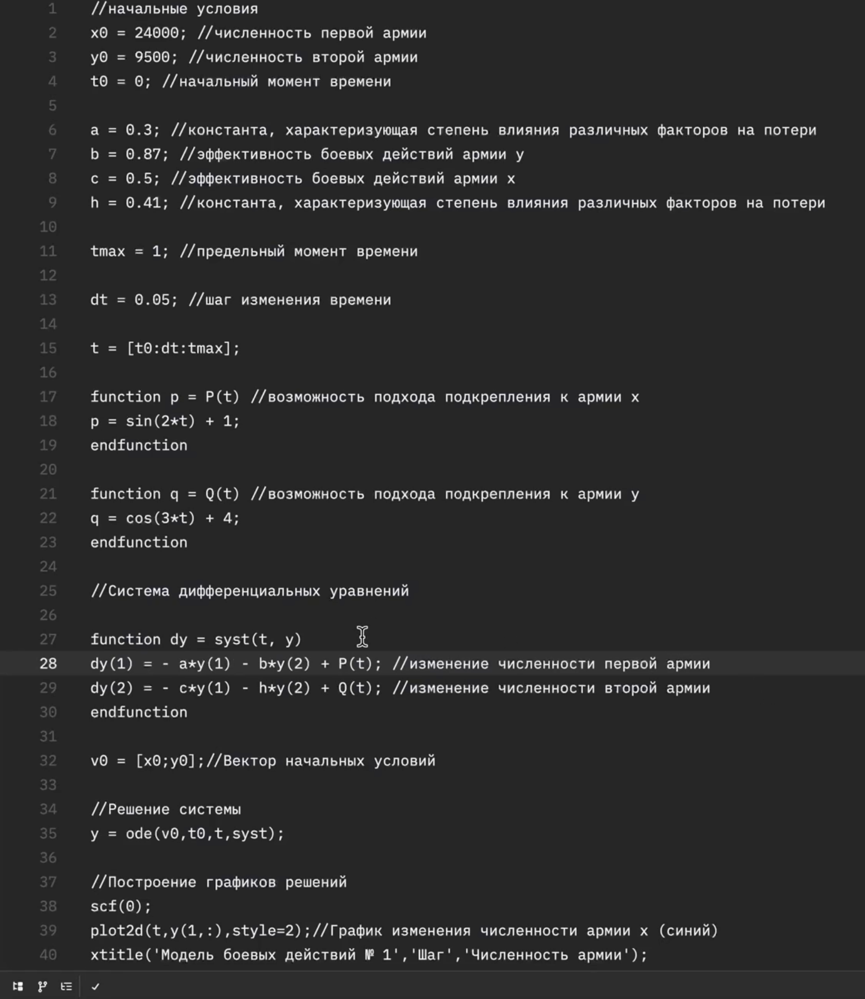

---
## Front matter
title: "Лабораторная работа №3"
subtitle: "Модель боевых действий"
author: "Поляков Глеб Сергеевич"

## Generic otions
lang: ru-RU
toc-title: "Содержание"

## Bibliography
bibliography: bib/cite.bib
csl: pandoc/csl/gost-r-7-0-5-2008-numeric.csl

## Pdf output format
toc: true # Table of contents
toc-depth: 2
lof: true # List of figures
lot: true # List of tables
fontsize: 12pt
linestretch: 1.5
papersize: a4
documentclass: scrreprt
## I18n polyglossia
polyglossia-lang:
  name: russian
  options:
	- spelling=modern
	- babelshorthands=true
polyglossia-otherlangs:
  name: english
## I18n babel
babel-lang: russian
babel-otherlangs: english
## Fonts
mainfont: IBM Plex Serif
romanfont: IBM Plex Serif
sansfont: IBM Plex Sans
monofont: IBM Plex Mono
mathfont: STIX Two Math
mainfontoptions: Ligatures=Common,Ligatures=TeX,Scale=0.94
romanfontoptions: Ligatures=Common,Ligatures=TeX,Scale=0.94
sansfontoptions: Ligatures=Common,Ligatures=TeX,Scale=MatchLowercase,Scale=0.94
monofontoptions: Scale=MatchLowercase,Scale=0.94,FakeStretch=0.9
mathfontoptions:
## Biblatex
biblatex: true
biblio-style: "gost-numeric"
biblatexoptions:
  - parentracker=true
  - backend=biber
  - hyperref=auto
  - language=auto
  - autolang=other*
  - citestyle=gost-numeric
## Pandoc-crossref LaTeX customization
figureTitle: "Рис."
tableTitle: "Таблица"
listingTitle: "Листинг"
lofTitle: "Список иллюстраций"
lotTitle: "Список таблиц"
lolTitle: "Листинги"
## Misc options
indent: true
header-includes:
  - \usepackage{indentfirst}
  - \usepackage{float} # keep figures where there are in the text
  - \floatplacement{figure}{H} # keep figures where there are in the text
---

# Цель работы

Между страной Х и страной У идет война. Численность состава войск исчисляется от начала войны, и являются временными функциями xt( ) и yt( ). В начальный момент времени страна Х имеет армию численностью 22 000 человек, а в распоряжении страны У армия численностью в 19 000 человек. Для упрощения модели считаем, что коэффициенты a b c h , , , постоянны. Также считаем Pt( ) и Q t( ) непрерывные функции.

# Задание

Постройте графики изменения численности войск армии Х и армии У для следующих случаев:

1. Модель боевых действий между регулярными войсками

2. Модель ведение боевых действий с участием регулярных войск и партизанских отрядов

# Выполнение лабораторной работы

1. Получение номера варианта

{#fig:001 width=70%}

1. Модель боевых действий между регулярными войсками

{#fig:002 width=70%}
{#fig:003 width=70%}

2. Модель ведение боевых действий с участием регулярных войск и партизанских отрядов

{#fig:004 width=70%}
{#fig:005 width=70%}

# Выводы

Построил графики изменения численности войск армии Х и армии У для следующих случаев:

1. Модель боевых действий между регулярными войсками

2. Модель ведение боевых действий с участием регулярных войск и партизанских отрядов

# Список литературы{.unnumbered}

::: {#refs}
:::
